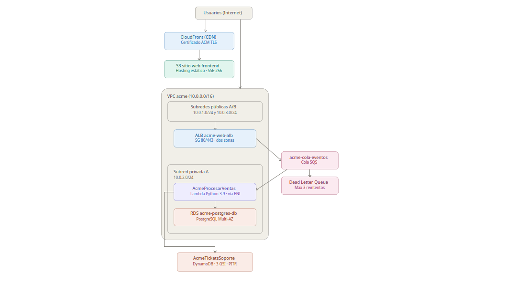
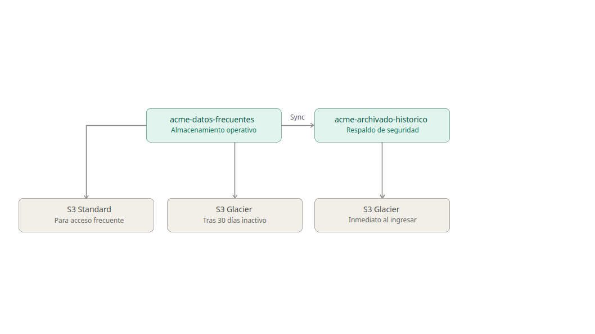
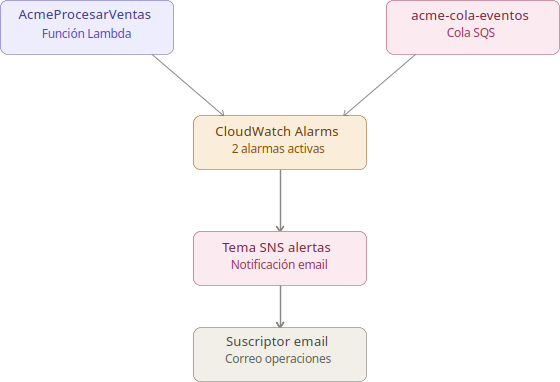

# Proyecto de Portafolio 4: Infraestructura Viva (ACME)

Este proyecto implementa y despliega de manera automatizada la arquitectura en la nube para la infraestructura de **ACME**, migrando sus servicios locales hacia una solución robusta en AWS simulada mediante **Floci**. 

La arquitectura abarca desde el almacenamiento seguro y bases de datos gestionadas (SQL/NoSQL) hasta redes privadas y públicas, sistemas serverless, mensajería distribuida y un plan proactivo de monitoreo con alarmas.

---

## Prerrequisitos (Entorno Linux)

Para ejecutar este despliegue de manera local, asegúrate de contar con las siguientes herramientas en tu sistema operativo Linux:

1. **Docker y Docker Compose**: Para levantar el entorno de simulación local de AWS (Floci).
2. **AWS CLI**: La interfaz de línea de comandos de AWS configurada para apuntar al endpoint local.
3. **Python 3.x**: Requerido para la lógica interna y ejecución de la función Lambda.
4. **Herramienta `zip`**: Necesaria para empaquetar el código de la función Lambda antes del despliegue.

---

## ⚙️ Preparación del Entorno

1. **Iniciar el contenedor de Floci/LocalStack**:
   Encuentra el archivo `docker-compose.yml` en la raíz del proyecto y levanta el servicio ejecutando en tu terminal:
   ```bash
   docker-compose up -d
   ```

2. **Verificar que el servicio local esté activo**:
   ```bash
   curl http://localhost:4566/_localstack/health
   ```

---

## Despliegue Automatizado

El despliegue completo de las 8 partes del portafolio se realiza a través del script principal corregido y validado contra fallas.

1. Conceder permisos de ejecución al script:
   ```bash
   chmod +x despliegue.sh
   ```
2. Ejecutar el despliegue:
   ```bash
   ./despliegue.sh
   ```

---

## Diagramas de Arquitectura

A continuación se detallan los tres diagramas que componen la solución propuesta para la arquitectura en AWS Cloud para ACME:

### 1. Flujo General y Procesamiento
Muestra el camino que sigue la información desde que el usuario ingresa al sistema. Por un lado, se sirve la web de la empresa de forma rápida y segura mediante una red de distribución (CloudFront) asociada a un almacén de archivos (S3). Por otro lado, las solicitudes de ventas pasan a un balanceador de carga público, se encolan ordenadamente en SQS y son procesadas por una función de cómputo (Lambda) oculta en una red privada, la cual la idea es que interactue con las bases de datos en RDS PostgreSQL y DynamoDB.



### 2. Flujo de Almacenamiento y Respaldos
Explica cómo se protegen los archivos de la empresa a bajo costo. Diariamente se realiza una copia incremental desde el almacenamiento principal hacia un bucket de backup histórico. Ambos almacenes cuentan con reglas automáticas de ciclo de vida que mueven los datos antiguos y los respaldos a una capa de archivo frío (S3 Glacier) para aportar en mnimizar el gasto mensual.



### 3. Flujo de Monitoreo y Alertas
Describe la supervisión del sistema ante incidentes. CloudWatch vigila la cantidad de mensajes acumulados en la cola de procesamiento y los fallos de la función Lambda. Si las métricas cruzan los umbrales, se activan alarmas que se comunican con el servicio de notificaciones (SNS) para despachar inmediatamente una alerta al correo electrónico del equipo de soporte.



---

## Entregable

* **[Informe Final del Proyecto (PDF)](INFORME_FINAL.pdf)**
  Este informe es el documento maestro que detalla las justificaciones teóricas de los servicios y sus configuraciones.

